# Luciano Menezes (@luciano655dev)

  
  
  
  
  

  

  
  
  

  

---

### About me

I'm Luciano Menezes, a fullstack developer focused on building real products from scratch.

I am **Brazillian**, I speak **Portuguese** and **English** fluently, and basic **Spanish**.   
I enjoy working on projects that combine technology with meaning, especially platforms that help society in various ways. For me, technology is a means to achieve the goal you seek.  

Currently building:

- <a href="https://daykeeper.app>">**Daykeeper.app**</a> → a journal style social + calendar platform to turn days into memories  
- <a href="https://hobbyasap.com>">**HobbyASAP.com**</a> → an AI-powered platform to help people learn new hobbies
- <a href="https://onemoregood.org>">**OneMoreGood.org**</a> → a non-profit e-commerce to fundraise money to small organizations in Brazil

---

### Stats

  

---

This is just a quick introduction.

My full portfolio with projects and details is here:  
👉 https://luciano655dev.netlify.app

Contact me!

### Contact

  
  
  
  
  

